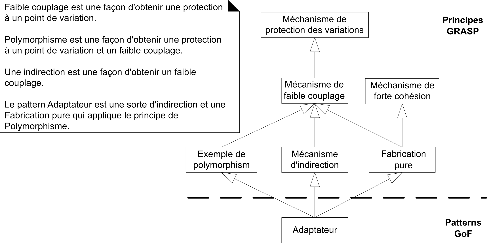

# Décortiquer les patterns GoF avec GRASP{#sec:GRASP-GoF}

Craig Larman a proposé les GRASP pour faciliter la compréhension des forces essentielles de la conception orientée-objet. Dans ce chapitre, on examine la présence des GRASP dans les patterns GoF. C'est une excellente façon de mieux comprendre et les principes GRASP et les patterns GoF.

## Exemple avec Adaptateur

Le chapitre A26/F23\ \faBook\ présente l'exemple du pattern Adaptateur pour les calculateurs de taxes (figure\ \ref{Fig23-1} tirée du livre de Larman, Figure A26.3/F23.3).

{#Fig23-1}

## Imaginer le code sans le pattern GoF

Chaque principe GRASP est défini avec un énoncé d'un problème de conception et une solution pour le résoudre. Pourtant, beaucoup d'exemples dans le livre de LOG210 sont des patterns déjà appliqués (et le problème initial n'est pas toujours expliqué en détail). 

Alors, pour mieux comprendre l'application des patterns GoF, on doit imaginer la situation du logiciel *avant* l'application du pattern. Dans l'exemple avec l'adaptateur pour les calculateurs de taxes, imaginez le code si on n'avait aucun adaptateur. À la place d'une méthode `getTaxes()` envoyée par la classe Vente à l'adaptateur, on serait obligé de faire un branchement selon le type de calculateur de taxes externe utilisé actuellement (si on veut supporter plusieurs calculateurs). Donc, dans la classe Vente, il y aurait du code comme ceci:

```Java
/* calculateurTaxes est le nom du calculateur utilisé actuellement */
if(calculateurTaxes == "GoodAsGoldTaxPro") {
    /* série d'instructions pour intéragir avec le calculateur */
} else if(calculateurTaxes == "TaxMaster") {
    /* série d'instructions pour intéragir avec le calculateur */
} else if /* ainsi de suite pour chacun des calculateurs */
    /* ... */
}
```

Pour supporter un nouveau calculateur de taxes, il faudrait coder une nouvelle branche dans le bloc de `if/then`. 
Ça nuirait à la lisibilité du code et la méthode qui contient tout ce code deviendrait de plus en plus longue. 
Même si on faisait une méthode pour encapsuler le code de chaque branche, ça ferait toujours augmenter les responsabilités de la classe Vente. 
Elle est responsable de connaître tous les détails (l'API distinct et immuable) de chaque calculateur de taxe externe, puisqu'elle communique directement (il y a du couplage) à ces derniers.

Le pattern Adaptateur comprend les principes GRASP Faible couplage, Forte cohésion, Polymorphisme, Indirection, Fabrication pure et Protection des variations. La figure\ \ref{Fig23-3} (tirée du livre de Larman, Figure A26.3/F23.3) démontre la relation entre ces principes dans le cas d'Adaptateur.

{#Fig23-3}

On peut donc voir le pattern adaptateur comme *une spécialisation* de plusieurs principes GRASP:

- Polymorphisme
- Indirection
- Fabrication pure
- Faible couplage
- Forte cohésion
- Protection des variations

Êtes-vous en mesure d'expliquer dans ce contexte comment Adaptateur est relié à ces principes? C'est-à-dire, pouvez-vous identifier les GRASP dans le pattern Adaptateur?

## Identifier les GRASP dans les GoF

Pour identifier les principes GRASP dans un pattern GoF comme Adaptateur, on rappelle la définition de chaque principe GRASP et on essaie d'imaginer le problème qui pourrait exister et comment le principe (et le pattern GoF) résout le problème.

Référez-vous à la figure\ \ref{Fig23-1} du pattern Adaptateur pour les sections suivantes.

### Polymorphisme

> **Problème:** Qui est responsable quand le comportement varie selon le type?  
> **Solution:** Lorsqu'un comportement varie selon le type (classe), affectez la responsabilité de ce comportement - avec des opérations polymorphes - aux types pour lesquels le comportement varie.

Le "comportement qui varie" est la manière d'adapter les méthodes utilisées par le calculateur de taxes choisi à la méthode `getTaxes()`. Alors, cette "responsabilité" est affectée au type interface `IAdaptateurCalculTaxes` (et ces implémentations) dans l'opération polymorphe `getTaxes()`.

### Fabrication pure

> **Problème:** En cas de situation désespérée, que faire quand vous ne voulez pas transgresser les principes de faible couplage et de forte cohésion?  
> **Solution:** Affectez un ensemble très cohésif de responsabilités à une classe « comportementale » artificielle qui ne représente pas un concept du domaine - une entité fabriquée pour augmenter la cohésion, diminuer le couplage et faciliter la réutilisation.

La Fabrication pure est la classe "comportementale et artificielle" qui est la hiérarchie IAdaptateurCalculTaxes (comprenant chaque adaptateur concret). Elle est comportementale puisqu'elle ne fait qu'adapter des appels. Elle est artificielle puisqu'elle ne représente pas un élément dans le modèle du domaine. 

L'ensemble des adaptateurs concrets ont des "responsabilités cohésives" qui sont la manière d'adapter la méthode `getTaxes()` aux méthodes (immuables) des calculateurs de taxes externes. Elles ne font que ça. La cohésion est augmentée aussi dans la classe Vente qui n'a plus la responsabilité de s'adapter aux calculateurs de taxes externes. C'est le travail qui a été donné aux adaptateurs concrets. 

Le couplage est diminué, car la classe Vente n'est plus couplée directement aux calculateurs de taxes externes. La réutilisation des calculateurs est facilitée, car la classe Vente ne doit plus être modifiée si l'on veut utiliser un autre calculateur externe. Il suffit de créer un adaptateur pour ce dernier.

### Indirection

> **Problème:** Comment affecter les responsabilités pour éviter le couplage direct?  
> **Solution:** Pour éviter le couplage direct, affectez la responsabilité à un objet qui sert d'intermédiaire avec les autres composants ou services.

Le "couplage direct" qui est évité est le couplage entre la classe Vente et les calculateurs de taxes externes. Le pattern Adaptateur (général) cherche à découpler le Client des classes nommées Adaptee, car chaque Adaptee a une API différente pour le même genre de "service". Alors, la responsabilité de s'adapter aux services différents est affectée à la hiérarchie de "classes intermédiaires", soit l'interface type IAdaptateurCalculTaxes et ses implémentations.

### Protection des variations

> **Problème:** Comment affecter les responsabilités aux objets, sous-systèmes et systèmes de sorte que les variations ou l'instabilité de ces éléments n'aient pas d'impact négatif sur les autres?  
> **Solution:** Identifiez les points de variation ou d'instabilité prévisibles et affectez les responsabilités afin de créer une « interface » stable autour d'eux.

Les "variations ou l'instabilité" sont les calculateurs de taxes qui ne sont pas sous le contrôle des développeurs du projet (ce sont des modules externes ayant chacun une API différente). Quant à "l'impact négatif sur les autres", il s'agit des modifications que les développeurs auraient à faire sur la classe Vente chaque fois que l'on décide de supporter un autre calculateur de taxes (ou si l'API de ce dernier évolue). 

Quant aux "responsabilités" à affecter, c'est la fonctionnalité commune de tous les calculateurs de taxes, soit le calcul de taxes. Pour ce qui est de "l'interface stable", il s'agit de la méthode `getTaxes()` qui ne changera jamais. Elle est définie dans le type-interface IAdaptateurCalculTaxes. Cette définition isole (protège) la classe Vente des modifications (ajout de nouveaux calculateurs ou changements de leur API). 

## GRASP et réusinage

Il y a des liens entre les GRASP et les activités de \nameref{Refactoring}. 
Alors, un IDE qui automatise les *refactorings* peut vous aider à appliquer certains GRASP.

- GRASP Polymorphisme est relié à [Replace Type Code with Subclasses](https://refactoring.com/catalog/replaceTypeCodeWithSubclasses.html) et [Replace conditional with polymorphism](https://refactoring.com/catalog/replaceConditionalWithPolymorphism.html) -- attention, il vaut mieux appliquer ce dernier seulement quand il y a des instructions conditionnelles (`switch`) répétées à plusieurs endroits dans le code.
- GRASP Fabrication pure est relié à [Extract class](https://refactoring.com/catalog/extractClass.html).
- GRASP Indirection est relié à [Extract function](https://refactoring.com/catalog/extractFunction.html) et [Move function](https://refactoring.com/catalog/moveFunction.html).
